# 샘플링한 AI 음성 기반 자기계발 플래너 서비스
1인 가구 사회초년생에게 부모님의 목소리로 외출, 일정을 알려주는 자기계발 플래너 서비스

# 🛠️ Stack

# ✏️ 프로젝트 목표

바쁜 일상을 계획적으로 정리해주고 일상 속에서 부모님의 목소리로 된 알람을 통해 부모님을 떠올릴 수 있어 연락 횟수가 증가할 수 있다.

부모님의 목소리로 일상적인 일들에 따뜻한 감정을 더해준다. 

부모님 목소리로 된 메시지에는 더 많은 지원과 격려가 담겨있어 사용자는 자기 계발이나 목표 달성 시 더욱 강력한 동기부여를 받을 수 있습니다.

직접 전화를 드리기 어려운 순간(새벽 시간대, 근무 시간대)에 본 프로그램을 통해 간접적으로 부모님의 위로를 받을 수 있다.

# 📜 프로젝트 주요 기능

* 목표, 투두, 습관 플래너
* 캘린더에서 한눈에 보기
* 목소리 음성 학습
* 친구 채팅
* 목표별 성취율(매일, 한달 기준)

# 👼🏻 Team

- 팀장 김준형: FE
- 팀원 김광연: AI + BE
- 팀원 김도휘: BE + FE (+ BE 배포)
- 팀원 김요한: FE (+ FE 배포)
- 팀원 천승현: FE

# 📐 Architecture

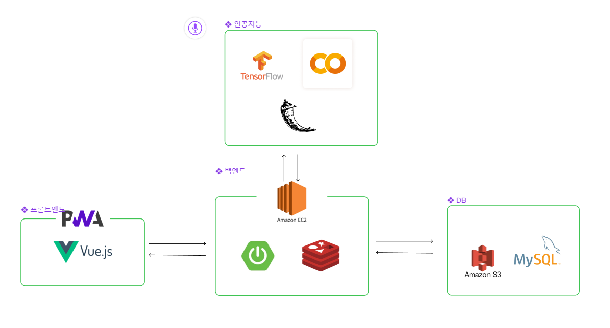

# 🖥️ 서비스 화면

## 메인화면
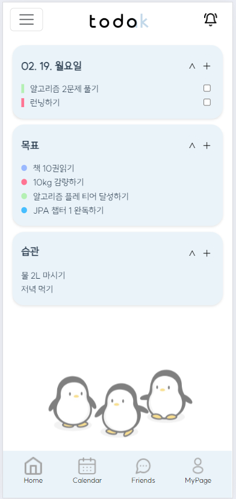

### 목표 추가화면
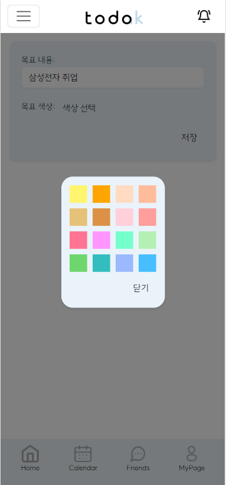

### 투두 상세화면
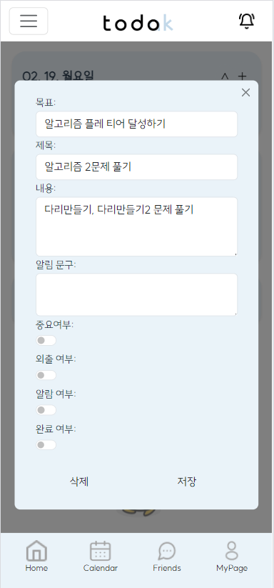

## 캘린더
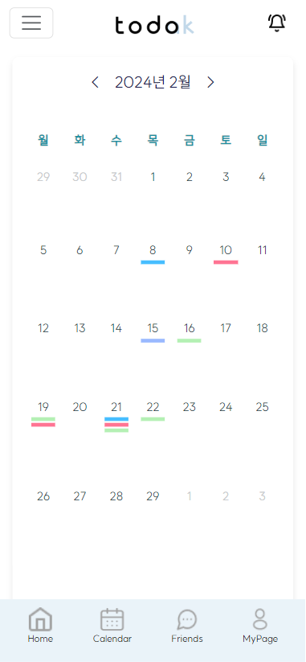
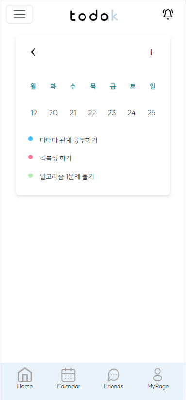

## 친구
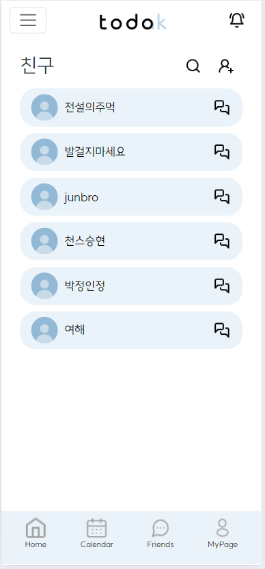
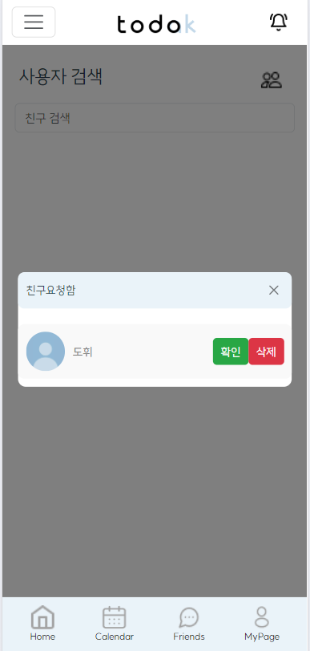
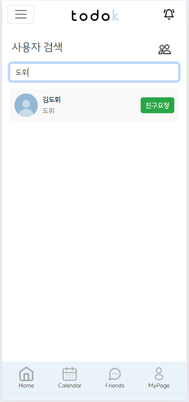

#### 채팅
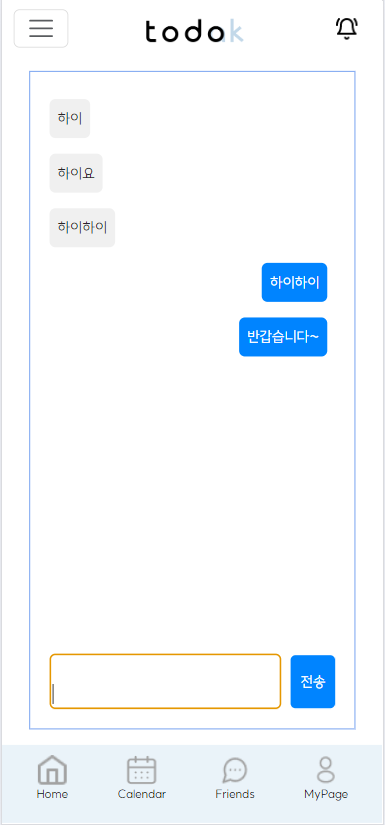

## 녹음
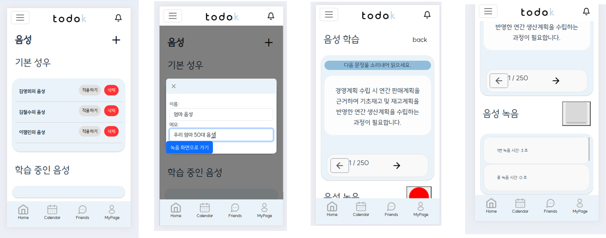

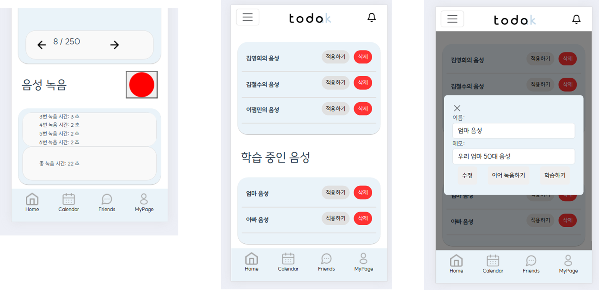

## 마이페이지
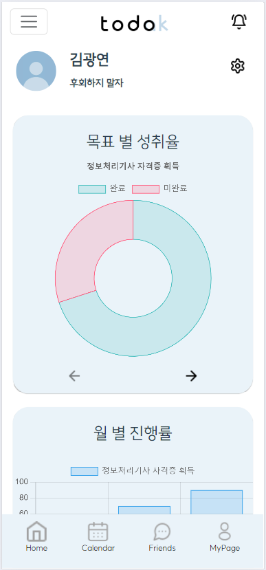
